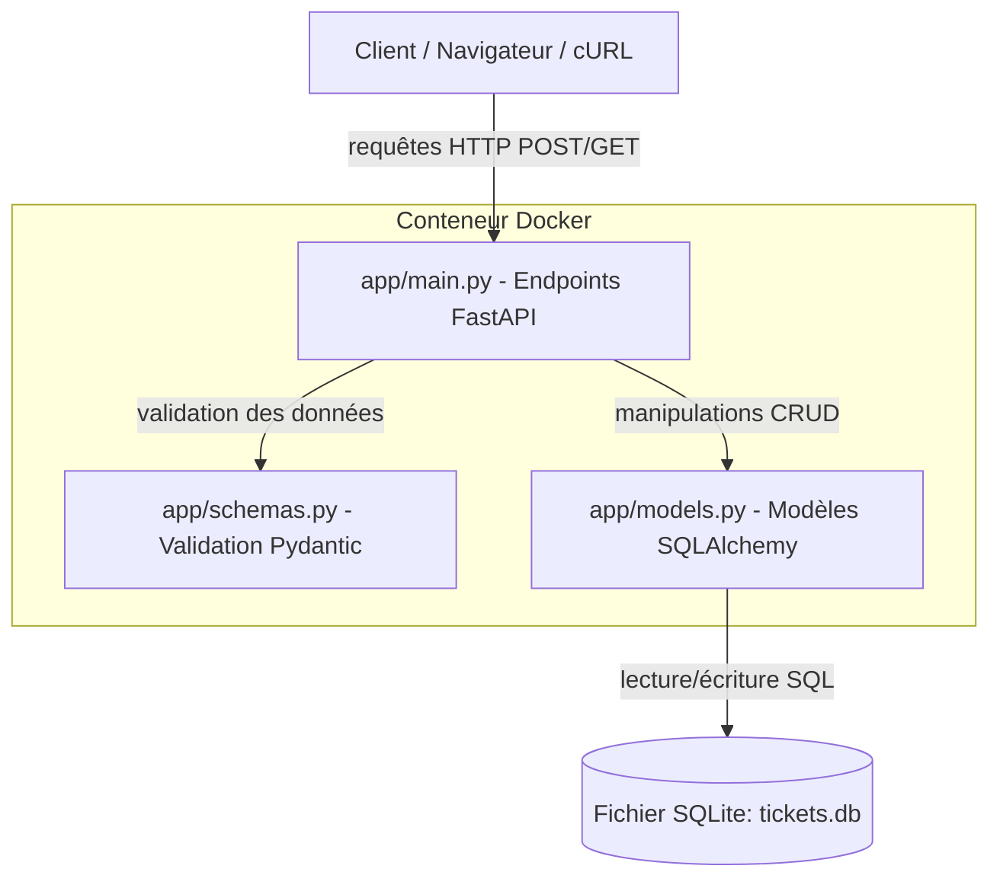

# Rapport de Projet - Système de Gestion de Tickets

Ce document constitue le rapport technique pour l'examen de master. Il est structuré de manière à séparer les contributions de l'Étudiant A (Moteur de base & Dockerisation) et de l'Étudiant B (Logique métier étendue, Tests & CI/CD).

---

## 🛠️ Partie Étudiant A : Moteur de Base et Dockerisation Locale

### 1. Introduction
Ce projet consiste en la réalisation d'une API de gestion de tickets de support technique, développée en Python à l'aide du framework moderne et performant **FastAPI**.
L'objectif principal est de fournir une base solide, performante et facilement déployable (grâce à **Docker**) permettant de créer (ouvrir) et lister des tickets de support.
Cette architecture de base a été conçue pour être modulaire et facilement extensible par un second développeur (Étudiant B) en vue d'intégrer des fonctionnalités avancées et une suite d'intégration continue (CI/CD).

### 2. Architecture de l'Application
L'application repose sur une architecture en couches simplifiée, assurant une séparation claire des responsabilités :
- **FastAPI / Uvicorn :** Couche API REST gérant le routage, la validation des entrées (via Pydantic) et la documentation interactive Swagger/OpenAPI.
- **SQLAlchemy (ORM) :** Couche de persistance assurant le mapping entre les objets Python et la base de données relationnelle.
- **SQLite :** Système de gestion de base de données relationnelle léger et autonome, stocké localement sous forme de fichier (`tickets.db`).

#### Schéma d'Architecture (Diagramme de Bloc)



#### Schéma de la Base de Données (Modèle de Ticket)
La table `tickets` possède les colonnes suivantes :
- `id` (INTEGER, Clé primaire, Auto-incrémentée) : Identifiant unique du ticket.
- `title` (VARCHAR, Non Null) : Titre ou résumé succinct du ticket.
- `description` (TEXT, Nullable) : Description détaillée du problème rencontré.
- `priority` (VARCHAR, Non Null) : Criticité du ticket, restreinte aux valeurs : `High`, `Medium`, `Low`.
- `status` (VARCHAR, Non Null, Défaut : `Ouvert`) : État d'avancement du ticket, restreint à : `Ouvert`, `En cours`, `Résolu`, `Fermé`.

### 3. Conteneurisation Locale
Afin d'assurer la reproductibilité du projet et de simplifier son déploiement local sans dépendre de l'installation de Python sur la machine hôte, une configuration Docker complète a été mise en place.

#### Dockerfile
Le `Dockerfile` est basé sur une image allégée `python:3.11-slim` :
- Il définit le répertoire de travail dans le conteneur (`/code`).
- Il copie et installe les dépendances listées dans `requirements.txt` en désactivant le cache de pip pour réduire la taille de l'image.
- Il copie le dossier source `app`.
- Il expose le port `8000`.
- Il démarre le serveur web de production/développement `uvicorn` avec une écoute sur toutes les interfaces réseau (`0.0.0.0`).

```dockerfile
FROM python:3.11-slim
WORKDIR /code
ENV PYTHONDONTWRITEBYTECODE 1
ENV PYTHONUNBUFFERED 1
COPY requirements.txt .
RUN pip install --no-cache-dir -r requirements.txt
COPY ./app ./app
EXPOSE 8000
CMD ["uvicorn", "app.main:app", "--host", "0.0.0.0", "--port", "8000"]
```

#### Docker Compose
Pour permettre le lancement en une seule commande (`docker compose up`), le fichier `docker-compose.yml` orchestre le conteneur :
- **Montage de Volume :** Le dossier local `./app` est monté sur `/code/app` dans le conteneur. Cela permet la prise en compte en temps réel des modifications de code sans nécessiter la reconstruction de l'image (Hot-reload en développement).
- **Redirection de Port :** Le port `8000` de l'hôte est redirigé vers le port `8000` du conteneur.
- **Variables d'environnement :** La variable `DATABASE_URL` est fournie pour pointer vers le fichier SQLite local `tickets.db`.

```yaml
version: '3.8'

services:
  web:
    build: .
    ports:
      - "8000:8000"
    volumes:
      - ./app:/code/app
    environment:
      - DATABASE_URL=sqlite:///./tickets.db
```

---

## 🚀 Partie Étudiant B : Logique Métier, Tests & CI/CD (À compléter par l'Étudiant B)

### 1. Stratégie Git & Workflow

Pour ce projet en binôme, nous avons adopté une stratégie Git basée sur les branches feature pour séparer le travail de l'Étudiant A et de l'Étudiant B :

**Branches principales :**
- `main` : Branche de production stable
- `develop` : Branche d'intégration où les deux étudiants fusionnent leur travail
- `feature/api-extensions-cicd` : Branche de travail de l'Étudiant B pour les extensions API et la mise en place CI/CD

**Workflow collaboratif :**
1. L'Étudiant A a réalisé le moteur de base et la Dockerisation sur la branche `main`
2. L'Étudiant B a créé la branche `feature/api-extensions-cicd` à partir de `develop`
3. Sur cette branche, l'Étudiant B a développé :
   - Les endpoints supplémentaires (PUT /tickets/{id})
   - Le filtrage par statut (GET /tickets?status=Ouvert)
   - La suite de tests automatisés
   - Le pipeline CI/CD (GitHub Actions)
4. Une Pull Request a été ouverte de `feature/api-extensions-cicd` vers `develop`
5. Après revue et validation, la PR a été fusionnée dans `develop`
6. De `develop`, une fusion finale vers `main` a été effectuée pour le déploiement

Cette approche garantit une séparation claire des responsabilités tout en permettant une intégration progressive et contrôlée.

### 2. Extensions d'API & Validation

L'Étudiant B a étendu l'API de base avec deux fonctionnalités clés pour la gestion des tickets de support :

#### Endpoint PUT /tickets/{id} - Mise à jour de ticket

Cet endpoint permet aux agents support de mettre à jour le statut d'un ticket et d'ajouter une réponse.

**Validation implémentée :**
- Vérification que le ticket existe (retour 404 si non trouvé)
- Validation du statut : seuls les statuts `Ouvert`, `En cours`, `Résolu`, `Fermé` sont acceptés
- Retour 400 si le statut est invalide

**Exemple d'utilisation :**
```bash
curl -X PUT http://localhost:8000/tickets/1 \
  -H "Content-Type: application/json" \
  -d '{"status":"En cours","response":"Investigation en cours"}'
```

#### Filtre GET /tickets?status=Ouvert - Filtrage par statut

Le endpoint GET existant a été enrichi avec un paramètre de query optionnel pour filtrer les tickets par statut.

**Validation implémentée :**
- Le paramètre `status` est optionnel (retourne tous les tickets si absent)
- Si fourni, le statut doit être valide parmi : `Ouvert`, `En cours`, `Résolu`, `Fermé`
- Retour 400 si le statut fourni est invalide

**Exemple d'utilisation :**
```bash
curl "http://localhost:8000/tickets/?status=Ouvert"
```

Ces extensions respectent les principes de validation robustes et maintiennent la cohérence des données dans la base.

### 3. Suite de Tests Automatisés

Une suite de tests complète a été implémentée using pytest pour valider le fonctionnement de l'API. Les tests utilisent une base de données SQLite en mémoire pour garantir l'isolation entre les tests.

**Configuration de test :**
- Base de données SQLite en mémoire (`sqlite:///:memory:`)
- Fixtures pytest pour la création automatique des tables avant chaque test
- Override de la dépendance de base de données pour utiliser la base de test
- Client FastAPI de test pour simuler les requêtes HTTP

**Tests implémentés :**

#### Test 1 : test_create_ticket
- **Objectif :** Valider la création d'un nouveau ticket via POST /tickets/
- **Vérifications :**
  - Code de statut HTTP 201 (Created)
  - Le titre du ticket correspond à celui envoyé
  - Le statut par défaut est "Ouvert"

#### Test 2 : test_read_tickets_filter
- **Objectif :** Valider le filtrage des tickets par statut via GET /tickets/?status=Ouvert
- **Vérifications :**
  - Code de statut HTTP 200
  - Seuls les tickets avec le statut spécifié sont retournés
  - Le nombre de résultats correspond au filtrage appliqué

#### Test 3 : test_update_ticket_status
- **Objectif :** Valider la mise à jour du statut d'un ticket via PUT /tickets/{id}
- **Vérifications :**
  - Code de statut HTTP 200
  - Le statut est mis à jour correctement
  - La réponse de l'agent est enregistrée

#### Test 4 : test_update_invalid_status
- **Objectif :** Valider le rejet des statuts invalides
- **Vérifications :**
  - Code de statut HTTP 400 (Bad Request)
  - Le système rejette les statuts non autorisés

**Exécution des tests :**
```bash
pytest app/test_main.py -v
```

### 4. Pipeline CI/CD (GitHub Actions)

Un pipeline CI/CD complet a été mis en place using GitHub Actions pour automatiser les tests et le déploiement de l'application.

**Fichier de configuration :** `.github/workflows/cicd.yml`

**Structure du pipeline :**

Le pipeline se compose de trois jobs principaux :

#### Job 1 : Lint
- **Déclencheur :** S'exécute sur tout push ou pull request vers main ou develop
- **Étapes :**
  1. `checkout` : Récupération du code source
  2. `setup-python@v4` : Installation de Python 3.11
  3. `Install Linting Tools` : Installation de flake8
  4. `Run Lint` : Exécution de flake8 pour vérifier la qualité du code

#### Job 2 : Test
- **Déclencheur :** S'exécute après succès du job lint, sur tout push ou pull request vers main ou develop
- **Étapes :**
  1. `checkout` : Récupération du code source
  2. `setup-python@v4` : Installation de Python 3.11
  3. `Install dependencies` : Installation des dépendances depuis requirements.txt
  4. `Run pytest Tests` : Exécution de la suite de tests avec `pytest`

#### Job 3 : Build and Push
- **Déclencheur :** S'exécute uniquement après succès du job test, et seulement sur push vers main
- **Étapes :**
  1. `checkout` : Récupération du code source
  2. `Log in to the Container Registry (GHCR)` : Authentification auprès du GitHub Container Registry
  3. `Extract Metadata` : Extraction des métadonnées pour Docker (tags, labels)
  4. `Build and Push Docker Image` : Construction et push de l'image Docker vers GHCR

**Configuration YAML complète :**

```yaml
name: CI/CD Pipeline

on:
  push:
    branches:
      - main
      - develop
  pull_request:
    branches:
      - main
      - develop

env:
  REGISTRY: ghcr.io
  IMAGE_NAME: ${{ github.repository }}

jobs:
  lint:
    name: Code Linting (flake8)
    runs-on: ubuntu-latest
    steps:
      - name: Checkout Code
        uses: actions/checkout@v3

      - name: Set up Python
        uses: actions/setup-python@v4
        with:
          python-version: '3.11'

      - name: Install Linting Tools
        run: |
          python -m pip install --upgrade pip
          pip install flake8

      - name: Run Lint
        run: |
          # Stop the build if there are Python syntax errors or undefined names
          flake8 . --count --select=E9,F63,F7,F82 --show-source --statistics
          # Exit-zero treats all other errors as warnings.
          flake8 . --count --exit-zero --max-complexity=10 --max-line-length=127 --statistics

  test:
    name: Run Unit Tests (pytest)
    runs-on: ubuntu-latest
    needs: lint
    steps:
      - name: Checkout Code
        uses: actions/checkout@v3

      - name: Set up Python
        uses: actions/setup-python@v4
        with:
          python-version: '3.11'

      - name: Install Dependencies
        run: |
          python -m pip install --upgrade pip
          pip install -r requirements.txt

      - name: Run pytest Tests
        run: |
          pytest

  build-and-push:
    name: Build & Push Docker Image to GHCR
    runs-on: ubuntu-latest
    needs: test
    if: github.ref == 'refs/heads/main' && github.event_name == 'push'
    permissions:
      contents: read
      packages: write
    steps:
      - name: Checkout Code
        uses: actions/checkout@v3

      - name: Log in to the Container Registry (GHCR)
        uses: docker/login-action@v2
        with:
          registry: ${{ env.REGISTRY }}
          username: ${{ github.actor }}
          password: ${{ secrets.GITHUB_TOKEN }}

      - name: Extract Metadata (tags, labels) for Docker
        id: meta
        uses: docker/metadata-action@v4
        with:
          images: ${{ env.REGISTRY }}/${{ env.IMAGE_NAME }}
          tags: |
            type=raw,value=latest
            type=sha,format=short

      - name: Build and Push Docker Image
        uses: docker/build-push-action@v4
        with:
          context: .
          push: true
          tags: ${{ steps.meta.outputs.tags }}
          labels: ${{ steps.meta.outputs.labels }}
```

**Avantages de ce pipeline :**
- Tests automatisés à chaque commit pour détecter les régressions
- Linting automatique pour maintenir la qualité du code
- Déploiement continu automatisé uniquement sur main après validation
- Images Docker versionnées et publiées sur GHCR pour reproductibilité

### 5. Orchestration de Conteneurs (Bonus Kubernetes)

Pour déployer l'application sur un cluster Kubernetes local (Minikube / MicroK8s), exécutez les commandes suivantes :

```bash
# 1. Appliquer la configuration de déploiement (Création des Pods)
kubectl apply -f k8s-deployment.yml

# 2. Exposer l'application via un Service NodePort
kubectl apply -f k8s-service.yml

# 3. Vérifier le statut des ressources déployées
kubectl get deployments
kubectl get pods
kubectl get services

# L'API est accessible sur n'importe quel nœud du cluster sur le port 30080: http://localhost:30080/docs
```

**Configuration Kubernetes :**

- **k8s-deployment.yml** : Définit le déploiement avec 2 replicas pour haute disponibilité, limites de ressources (CPU: 500m, Memory: 512Mi), et utilise l'image Docker depuis GHCR
- **k8s-service.yml** : Expose l'application via un Service NodePort sur le port 30080, accessible depuis n'importe quel nœud du cluster

Cette configuration permet un déploiement scalable et résilient de l'application sur un cluster Kubernetes.

### 6. Captures d'Écran et Preuves de Fonctionnement
*(Section à rédiger par l'Étudiant B - Screenshots de la pipeline verte et du package Docker publié sur GHCR)*
