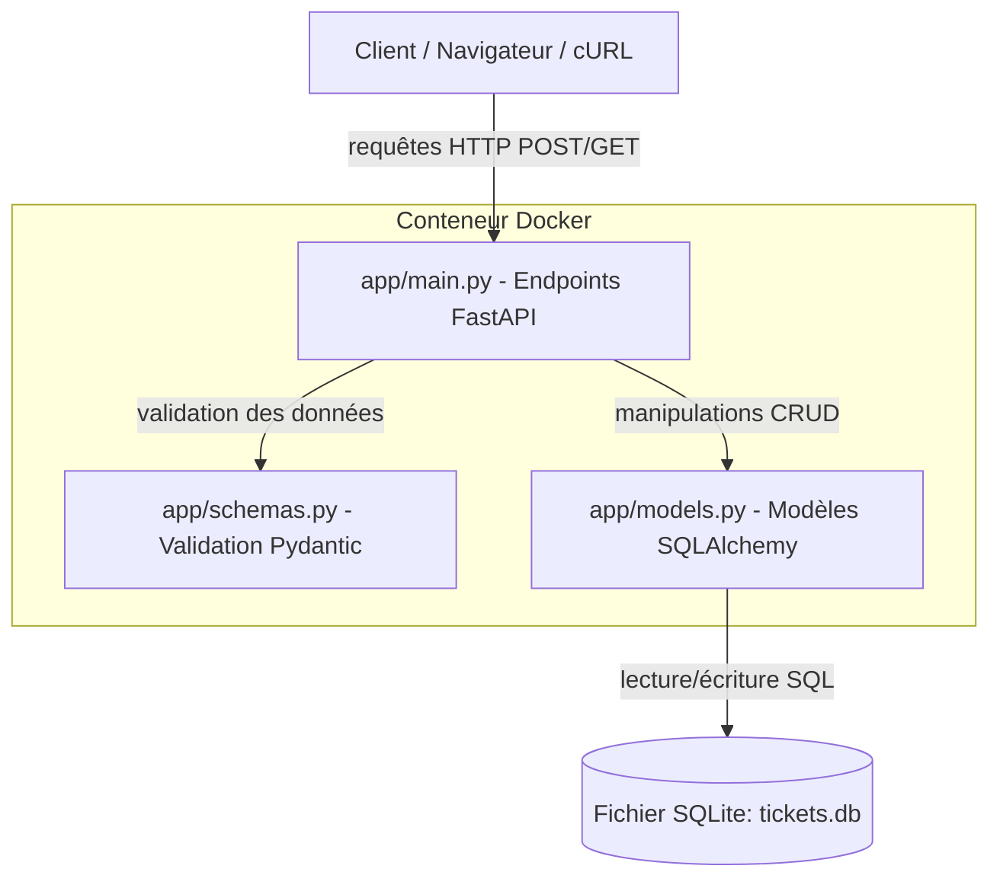

# Rapport de Projet - Système de Gestion de Tickets

Ce document constitue le rapport technique pour l'examen de master. Il est structuré de manière à séparer les contributions de l'Étudiant A (Moteur de base & Dockerisation) et de l'Étudiant B (Logique métier étendue, Tests & CI/CD).

---

## 🛠️ Partie Étudiant A : Moteur de Base et Dockerisation Locale

### 1. Introduction
Ce projet consiste en la réalisation d'une API de gestion de tickets de support technique, développée en Python à l'aide du framework moderne et performant **FastAPI**.
L'objectif principal est de fournir une base solide, performante et facilement déployable (grâce à **Docker**) permettant de créer (ouvrir) et lister des tickets de support.
Cette architecture de base a été conçue pour être modulaire et facilement extensible par un second développeur (Étudiant B) en vue d'intégrer des fonctionnalités avancées et une suite d'intégration continue (CI/CD).

### 2. Architecture de l'Application
L'application repose sur une architecture en couches simplifiée, assurant une séparation claire des responsabilités :
- **FastAPI / Uvicorn :** Couche API REST gérant le routage, la validation des entrées (via Pydantic) et la documentation interactive Swagger/OpenAPI.
- **SQLAlchemy (ORM) :** Couche de persistance assurant le mapping entre les objets Python et la base de données relationnelle.
- **SQLite :** Système de gestion de base de données relationnelle léger et autonome, stocké localement sous forme de fichier (`tickets.db`).

#### Schéma d'Architecture (Diagramme de Bloc)



#### Schéma de la Base de Données (Modèle de Ticket)
La table `tickets` possède les colonnes suivantes :
- `id` (INTEGER, Clé primaire, Auto-incrémentée) : Identifiant unique du ticket.
- `title` (VARCHAR, Non Null) : Titre ou résumé succinct du ticket.
- `description` (TEXT, Nullable) : Description détaillée du problème rencontré.
- `priority` (VARCHAR, Non Null) : Criticité du ticket, restreinte aux valeurs : `High`, `Medium`, `Low`.
- `status` (VARCHAR, Non Null, Défaut : `Ouvert`) : État d'avancement du ticket, restreint à : `Ouvert`, `En cours`, `Résolu`, `Fermé`.

### 3. Conteneurisation Locale
Afin d'assurer la reproductibilité du projet et de simplifier son déploiement local sans dépendre de l'installation de Python sur la machine hôte, une configuration Docker complète a été mise en place.

#### Dockerfile
Le `Dockerfile` est basé sur une image allégée `python:3.11-slim` :
- Il définit le répertoire de travail dans le conteneur (`/code`).
- Il copie et installe les dépendances listées dans `requirements.txt` en désactivant le cache de pip pour réduire la taille de l'image.
- Il copie le dossier source `app`.
- Il expose le port `8000`.
- Il démarre le serveur web de production/développement `uvicorn` avec une écoute sur toutes les interfaces réseau (`0.0.0.0`).

```dockerfile
FROM python:3.11-slim
WORKDIR /code
ENV PYTHONDONTWRITEBYTECODE 1
ENV PYTHONUNBUFFERED 1
COPY requirements.txt .
RUN pip install --no-cache-dir -r requirements.txt
COPY ./app ./app
EXPOSE 8000
CMD ["uvicorn", "app.main:app", "--host", "0.0.0.0", "--port", "8000"]
```

#### Docker Compose
Pour permettre le lancement en une seule commande (`docker compose up`), le fichier `docker-compose.yml` orchestre le conteneur :
- **Montage de Volume :** Le dossier local `./app` est monté sur `/code/app` dans le conteneur. Cela permet la prise en compte en temps réel des modifications de code sans nécessiter la reconstruction de l'image (Hot-reload en développement).
- **Redirection de Port :** Le port `8000` de l'hôte est redirigé vers le port `8000` du conteneur.
- **Variables d'environnement :** La variable `DATABASE_URL` est fournie pour pointer vers le fichier SQLite local `tickets.db`.

```yaml
version: '3.8'

services:
  web:
    build: .
    ports:
      - "8000:8000"
    volumes:
      - ./app:/code/app
    environment:
      - DATABASE_URL=sqlite:///./tickets.db
```

---

## 🚀 Partie Étudiant B : Logique Métier, Tests & CI/CD (À compléter par l'Étudiant B)

### 1. Stratégie Git & Workflow
*(Section à rédiger par l'Étudiant B - Explication de la branche `feature/api-extensions-cicd` et de la Pull Request vers `develop`)*

### 2. Extensions d'API & Validation
*(Section à rédiger par l'Étudiant B - Explication de `PUT /tickets/{id}` et du filtre `GET /tickets?status=Ouvert`)*

### 3. Suite de Tests Automatisés
*(Section à rédiger par l'Étudiant B - Description des 3 tests pytest)*

### 4. Pipeline CI/CD (GitHub Actions)
*(Section à rédiger par l'Étudiant B - Explication pas-à-pas du fichier `cicd.yml`)*

### 5. Captures d'Écran et Preuves de Fonctionnement
*(Section à rédiger par l'Étudiant B - Screenshots de la pipeline verte et du package Docker publié sur GHCR)*
